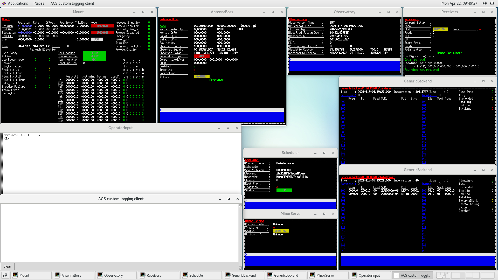

.. _connect:

*********************************
Connecting to a graphical session
*********************************

First SSH login
===============

Before we access a VNC graphical session, let's perform a basic SSH login to
check whether the received account has been already authorized. You should
receive a message similar to the one showed below. You need to type `yes` only
the first time you attempt to login via SSH.

.. code-block::

   $ ssh <username>@<ip-address>
   The authenticity of host 'AAA.BBB.CCC.DDD (AAA.BBB.CCC.DDD)' can't be established.
   ECDSA key fingerprint is SHA256:tQJUqMqDok2oxbGLcansTr3pt4SsADlGxQ7ggfnpQmz.
   Are you sure you want to continue connecting (yes/no/[fingerprint])? yes
   [<username>@natsrt ~]$

Now that we're sure you can properly login with the received account,
everything is set, you can now exit the new SSH shell:

.. code-block::

   [<username>@natsrt ~]$ exit
   logout
   Connection to AAA.BBB.CCC.DDD closed.

.. note::

   Your username and password and the IP address of the gateway will be provided
   to you by the SRT staff before the first training or observing session.

VNC graphical login
===================

Now everything should be ready, you can get back into the directory where you
downloaded the `srt-vnc` script and check if everything is working properly by
executing the following command:

.. code-block::

   $ ./srt-vnc -h
   srt-vnc v1.2
   Start a vncviewer session to a DISCOS machine.
   Usage: 'srt-vnc [OPTIONS] <username>@<vnc_session>'
   Options:
       -h | --help               prints this help message and exit
       -s | --sessions           prints the list of available VNC sessions
       -v | --viewonly           start the vncviewer in view only mode
       -d | --debug              print the debug output

You can also check which VNC sessions are available:

.. code-block::

   $ ./srt-vnc --sessions
   Available VNC sessions:

   discos-manager
   [...]
   discos-training

.. note::

   You will see several VNC sessions available, some of them are for actual
   observations, some other are for maintenance purposes, some are for
   training. Each user on the gateway has limited authorization so if you try
   to access a session and you see an error from the SSH authentication process
   you are most likely not authorized to access that specific VNC session.
   Contact the SRT staff if you have been previously given access to a specific
   session which is now not working.

Finally, you can access the desired session, for example `discos-training` by typing:

.. code-block::

   $ ./srt-vnc <username>@discos-training

You will be prompted your SSH password and, after a successful login, the VNC
viewer window should open automatically, something similar to this:

   The DISCOS training machine VNC session.
